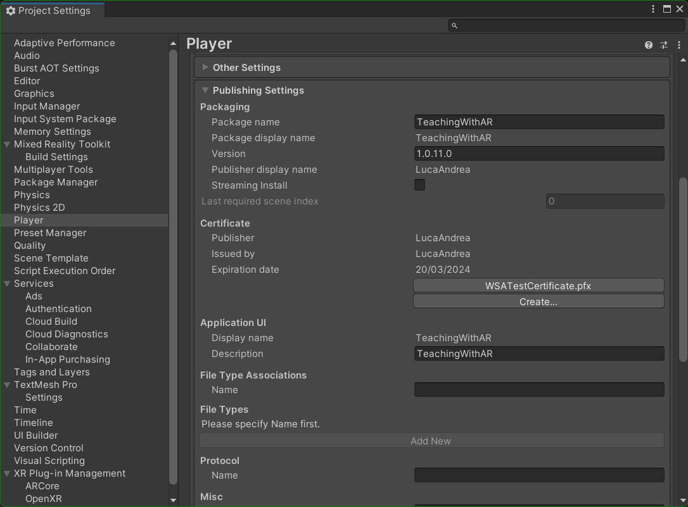

# [**HOCTOPUS: Empower Remote Class Teaching with Extended Reality**]()<br/> 🥽 + 📱 = 🐙


[Luca Asunis](https://www.linkedin.com/in/luca-asunis?miniProfileUrn=urn%3Ali%3Afs_miniProfile%3AACoAAC7swksBCCX_diC1XLaQWmcMON-KsQR9meU&lipi=urn%3Ali%3Apage%3Ad_flagship3_search_srp_all%3BoBHg60UxQfGCTxTSvzequg%3D%3D)\*,
[Andrea Cirina](https://www.linkedin.com/in/andrea-cirina-87a435279/)\*,
[Lorenzo Stacchio](https://www.unibo.it/sitoweb/lorenzo.stacchio2)\*,
[Gustavo Marfia](https://github.com/qp-qp)<br/>

\* Authors provided equal contributions.

| [ISMAR 23 - 1st Joint Workshop on Cross Reality](https://cross-realities.org/) | [project page](https://varlab-unibo.github.io/HOCTOPUS/) | [paper](https://cross-realities.org/proceedings.php) | [video](https://www.youtube.com/watch?v=rqcuqYxo6GE)

<p align="center">
  
</p>


``` 
HOCTOPUS provides an easy tool for both teachers and students to visualize, manipulate and share 3D objects in a live-stream fashion exploiting peer-to-peer network connections. In particular, HOCTOPUS consists of two main components thought for the two main actors of our use case: teachers and students. For teachers, we provided an MR streaming experience that let the user picks the 3D model for the class she/he wants to teach and straightforward interactions to manipulate during the explanation. For students instead, we developed an AR experience to visualize the streamed 3D object in a non-situated fashion, which real-time twins all the manipulations made by the teacher in the MR experience. Students have also the possibility to interact with the object and ask questions.

In particular, we developed the MR side of the system for the Hololens 2 and the AR one for Android mobile devices.
In practice, HOCTOPUS aims at supporting remote MR class teaching by streaming the teacher's manipulations of 3D models to all the students that joined the class, to enhance and improve the learning process of complex structures and processes.
``` 

## Requirements
* [Unity 2019.4.xx](https://unity.com/releases/editor/archive#download-archive-2019)
* [Unity Relay Service](https://unity.com/products/relay)
* [Unity Netcode for GameObjects](https://docs-multiplayer.unity3d.com/netcode/current/about/)

#### Already included in this repository
* [Object Outline](https://github.com/chrisnolet/QuickOutline.git)
* [Floor Finder](https://github.com/LocalJoost/FloorFinder.git)


## Features 
### Hololens 2 - Teacher
The **Mixed Reality teacher** application was implemented with the Hololens 2 and provides the **following features**: 

1. **Loading 3D models** for the objects the Teacher wants to use in its classes;
2. **Picking** one object;
3. Starting the **remote class**;
4. **Stream the manipulations** made with the object;
5. **Manage** the connected **students**.

The MR Teacher app exploits the **Unity Relay Service** by **hosting** the remote class session that the connecting clients will **join** (this aspect is used in features (3),(4), and (5)).

<p float="center">
  
  
</p>

### Android - Student
The **Mobile Augmented Reality student** one was designed for **smartphones** (in particular, Android-based ones). The student application provides the **following features**: 

1. **Visualizing** the current state of 3D models streamed by the teacher;
2. **Asking questions** related to the object;
3. **Manipulating the object** while doing a question to ease the comprehension between teacher and student. 

The student AR app exploits the UniRS to **connect to the hosted class** as connected clients. We here state that all the AR-related features were developed with **AR Foundation** and **AR core** and that the system can be used with **any Android smartphone** with a version greater or equal to **8.0 (Oreo)**.

<p align="center">
  
</p>


## Setting Up a Server Relay Using Unity Gaming Services

1. **Create a profile** on [Unity Gaming Services](https://dashboard.unity3d.com/gaming/login?redirectTo=L3JlbGF5 "Unity Gaming Services").

2. After registering, **create a new project** and assign a preferred name to it.

3. In the project interface, navigate to the **Multiplayer** section at the bottom-left corner.

4. Select the **Relay** option to initiate the server relay configuration.

<p align="center">
  
</p>

5. In the server relay screen, click on **Get started** to proceed.

6. Follow the **provided instructions** carefully for setup in the Unity project:
   - **Link Unity project**: 
     1) Open your project in the Unity Editor and navigate to **Edit** > **Project Settings**;
     2) From the Project Settings window, go to the **Services** tab;
     3) Click on **Use an existing Unity project ID** and link to the following Dashboard project:
          - **Organization**: \*\*Name of the organization\*\*;
          - **Project**: \*\*Name of the project\*\*
	 
	 5) Once you see the *Project was linked successfully* banner appear at the top of the window, you will be **ready** to move on.
   <p align="center">
     
   </p>

   - **Install package**: 
     1) *In Unity*, navigate to **Window** > **Package Manager**;
     2) From the Package Manager, search or scroll to find the **Relay** package within the Unity Registry;
     3) Select the package and click the **Install** button.
        <p align="center">
         
       </p>

Feel free to **skip the third step**, which suggests *Import a sample*. Instead,  just click on **Finish**. By following these steps, you'll be able to **successfully configure** the server relay within the Unity project  ✅ .


## Deploy
### Deployment Hololens 2
1. Go to `File -> Build Settings`. Here change the **platform** by selecting `Universal Windows Platform` and pressing on `Switch platform`. Once you have changed the platform, make sure you have these settings:
<p align="center">
  
</p>

2.  Next go to `Player Settings`, make sure you are on the correct platform and scroll down until you find `Publishing Settings`. Here you need to **create a new certificate** and **select it** for this project. At the end of the operation you will have a screen similar to this one:
<p align="center">
  
</p>

3.  Now go to `Mixed Reality -> Toolkit -> Utilities -> Build Window`. 
<p align="center">
  
</p>

4. In the window that will open, make sure you have the following settings:
<p align="center">
  
</p>

⚠️**Warning**⚠️. Make sure the folder you are doing the build in is **empty**!
Then click on `Build Unity Project`.

5. Once the build is finished, go to the folder that was created automatically (`Builds --> WSAPlayer`) and open the `.sln` file with visual studio. In the window on the right called `Solution Explorer`,  open the file `Package.appxmanifest` directly from **visual studio**. Click on `Create Package`, and you will see a screen similar to this one:
<p align="center">
  
</p>

Here click on `Choose certificate...` and select the one you created **earlier**.

6. Now go back to `Solution Explorer` and right-click on `Package.appxmanifest`, then `Open with... -> XML Editor`.  Here you need to make sure that `PhoneProductId` and `PhonePublisherId` have the **same code**. Also go all the way down and make sure the `Capabilities` are configured like this:    
 <p align="center">
  
</p>


🔴**Important**❗🔴 **Close** Visual Studio, a warning will appear and you will need to **save**. ⚠️ **Do not skip this step.** ⚠️

7. Now **go back to Unity** and in the `Build Window` section click on `Appx Build Options`. Put in the following settings:
<p align="center">
  
</p>

Finally click on `Build Appx`.

8. Now you'll just go to `<<NameOfTheProject>>\Builds\WSAPlayer\AppPackages\<<NameOfTheProject>>_1.0.1.0_ARM64_Test`.
Here you will find the package (`.appx`) to install on the Hololens 2. We recommend that you use the **device portal** for installation.
<p align="center">
  
</p>


### Deployment Android
As a reminder, at least **version 8.0 Oreo is required** for deployment on **Android**.
The settings for deploying on Android are the **same** as for **any augmented reality application**.
1. **Change the platform** to the Android platform;
2. Go to `Player Settings`;
3. In the `Other settings` section make sure you have the **following settings**:
<p align="center">
  
</p>

<p align="center">
  
</p>

<p align="center">
  
</p>

⚠️**Before** building, **connect** your smartphone to your pc and make sure it has **usb debugging enabled**. At this point **you can build and deploy** to your smartphone.⚠️

## Main Unity Scene

The main unity scene is in the [```Assets/Scenes/MainScene.unity```](Assets/Scenes/).


## Cite this work

```
@inproceedings{asunis2023hoctopus,
  title={HOCTOPUS: An Open-Source Cross-Reality tool to Augment Live-Streaming Remote Classes},
  author={Asunis, Luca and Cirina, Andrea and Stacchio, Lorenzo and Marfia, Gustavo},
  booktitle={2023 IEEE International Symposium on Mixed and Augmented Reality Adjunct (ISMAR-Adjunct)},
  pages={29--34},
  year={2023},
  organization={IEEE}
}
```
